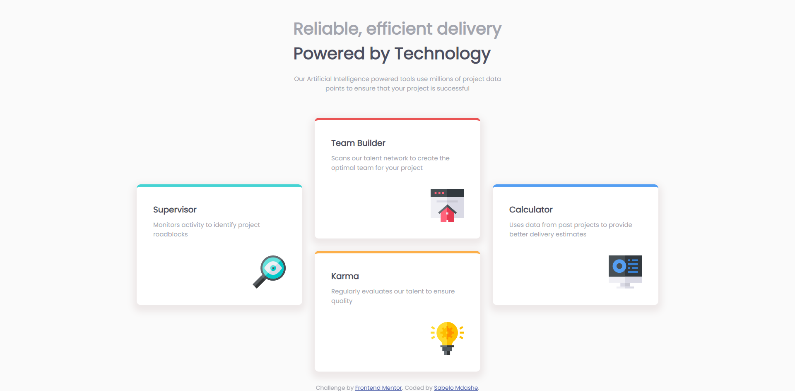

# Frontend Mentor - Four card feature section solution

This is a solution to the [Four card feature section challenge on Frontend Mentor](https://www.frontendmentor.io/challenges/four-card-feature-section-weK1eFYK). Frontend Mentor challenges help you improve your coding skills by building realistic projects. 

## Table of contents

- [Overview](#overview)
  - [The challenge](#the-challenge)
  - [Screenshot](#screenshot)
  - [Links](#links)
- [My process](#my-process)
  - [Built with](#built-with)
  - [What I learned](#what-i-learned)
  - [Continued development](#continued-development)
  - [Useful resources](#useful-resources)
- [Author](#author)

## Overview

### The challenge

Users should be able to:

- View the optimal layout for the site depending on their device's screen size

### Screenshot



### Links

- Solution URL: [Add solution URL here](https://www.frontendmentor.io/solutions/four-card-feature-section-uHDm_H4CPx)
- Live Site URL: [Netlify](https://bucolic-mochi-4e3bf2.netlify.app/)
- GitHub URL: [Add github URL here](https://github.com/Sabelo-Mdashe/four-card-feature-section-master)

## My process

### Built with

- Semantic HTML5 markup
- CSS custom properties
- Flexbox
- Mobile-first workflow

### What I learned

I learnt to use CSS shadows.

```css
.card {
  box-shadow: 1em 0 rgba(255, 255,);
}
```

### Continued development

I am makinng progress with CSS I really feel like I am getting better and better.

### Useful resources

- [Google Fonts](https://fonts.google.com/) - I used google fonts to match the font for the challenge.

## Author

- Website - [Sabelo Mdashe](http://sabelomdashe.co.za)
- Frontend Mentor - [@Sabelo-Mdashe](https://www.frontendmentor.io/profile/Sabelo-Mdashe)
- GitHub - [https://github.com/Sabelo-Mdashe]
